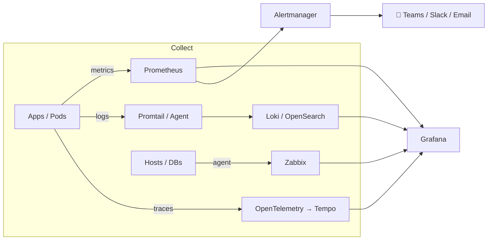

<div align="center">

# 🗺️ The DevOps Roadmap

*Follow this in order. Each phase builds on the previous one.*

[⬅️ Back to Home](README.md) · [🧪 Labs](labs/README.md) · [🎯 Interview Prep](interview-prep/README.md)

</div>

---

## 🧱 Phase 1 — Foundations (Week 1)

> *Every server, every container, every Kubernetes node runs Linux. Start here.*

| ✅ | Topic | Learn | Practice |
|:-:|---|---|---|
| ☐ | **Linux filesystem** | `/etc`, `/var/log`, `/home`, permissions (`chmod`, `chown`) | Read `/etc/os-release`, explore `/var/log` |
| ☐ | **Processes** | `ps aux`, `top`, `htop`, `kill`, `systemctl`, `journalctl` | Find the process eating the most CPU |
| ☐ | **Networking** | IP, ports, DNS, `ss -tulpn`, `curl`, `dig`, `ping` | Find which process is listening on port 22 |
| ☐ | **Disk** | `df -h`, `du -sh`, `lsblk`, log rotation | Find the largest directory under `/var` |
| ☐ | **Git basics** | `init`, `add`, `commit`, `log`, `diff` | 5 commits on a practice repo |
| ☐ | **Git branching** | `branch`, `checkout`, `merge`, `rebase`, PRs | Create branch → change → merge to `main` |

📌 **Milestone:** You can SSH into a server, find out why it's slow, and push your notes to GitHub.

---

## 🐳 Phase 2 — Containers (Week 1–2)

> *"It works on my machine" → "It works on every machine."*

| ✅ | Topic | Key idea |
|:-:|---|---|
| ☐ | **Container vs VM** | Containers share the host kernel (namespaces + cgroups), so they're lightweight and start in milliseconds |
| ☐ | **Image vs Container** | Image = class/blueprint, Container = running object |
| ☐ | **Dockerfile** | `FROM`, `COPY`, `RUN`, `CMD`, `ENTRYPOINT`, layer caching, `.dockerignore` |
| ☐ | **Multi-stage builds** | Build in a fat image, ship in a tiny one (`alpine` / `distroless`) |
| ☐ | **Networking & volumes** | bridge / host networks, named volumes, bind mounts |
| ☐ | **Docker Compose** | Multi-container apps on one machine |
| ☐ | **Registries** | Tag & push to Docker Hub / Amazon ECR |
| ☐ | **Security** | Run as non-root, scan images, read-only filesystem |

📌 **Milestone:** [Lab 02](labs/02-docker.md): your own image, running on port 8080, pushed to a registry.

---

## ☁️ Phase 3 — Cloud: AWS (Week 2)

| ✅ | Service | What you must be able to explain |
|:-:|---|---|
| ☐ | **VPC** | CIDR, public vs private subnets, route tables, IGW, NAT, Security Groups vs NACLs |
| ☐ | **EC2** | Instance types, AMIs, EBS, user-data, Auto Scaling |
| ☐ | **IAM** | Users vs roles vs policies, **least privilege**, instance roles instead of access keys |
| ☐ | **S3** | Buckets, versioning, lifecycle rules, encryption, bucket policies |
| ☐ | **RDS / ElastiCache / MSK** | Managed DB, Redis, Kafka: when to use managed vs self-hosted |
| ☐ | **Lambda + EventBridge** | Serverless functions on a schedule or event |
| ☐ | **CloudWatch** | Metrics, logs, alarms, SNS notifications |
| ☐ | **Route53** | Hosted zones, A / CNAME / Alias records, health checks |

⚠️ **Day 1 task:** create a **billing alarm**. Protect your wallet!

📌 **Milestone:** Draw a production VPC diagram from memory.

---

## 🏗️ Phase 4 — Infrastructure as Code (Week 2–3)

```
terraform init  →  terraform plan  →  terraform apply  →  terraform destroy
    (setup)          (preview)          (create)            (cleanup)
```

| ✅ | Topic |
|:-:|---|
| ☐ | Providers, resources, data sources |
| ☐ | Variables, outputs, `terraform.tfvars` |
| ☐ | **State**: what it is, why it matters, remote backend (S3 + locking) |
| ☐ | Modules: reuse & DRY |
| ☐ | `plan` in CI, drift detection, `import` |

📌 **Milestone:** [Lab 03](labs/03-terraform.md): a VPC + EC2 + S3 created and destroyed with code.

---

## ☸️ Phase 5 — Orchestration (Week 3)

| ✅ | Topic | |
|:-:|---|---|
| ☐ | **K8s architecture** | API server, etcd, scheduler, controller-manager, kubelet, kube-proxy |
| ☐ | **Core objects** | Pod, ReplicaSet, Deployment, Service (ClusterIP / NodePort / LoadBalancer), Ingress |
| ☐ | **Config** | ConfigMap, Secret, env vars vs mounted volumes |
| ☐ | **Health & scaling** | Liveness / readiness probes, resource requests/limits, HPA |
| ☐ | **Storage** | PV, PVC, StorageClass *(and orphaned PVCs cost money!)* |
| ☐ | **Managed vs self-managed** | EKS vs KOPS vs kubeadm |
| ☐ | **Helm** | Charts, `values.yaml`, `helm install/upgrade/rollback` |
| ☐ | **ArgoCD / GitOps** | Git is the source of truth, and the cluster syncs itself from it |

📌 **Milestone:** [Labs 04–06](labs/README.md): deploy → Helm-package → GitOps-sync an app.

---

## 📈 Phase 6 — Observability (Week 4)

> *This is my specialty. Observability is how you **know** production is healthy instead of hoping it is.* 🔭



| ✅ | Pillar | Tools | Learn |
|:-:|---|---|---|
| ☐ | **Metrics** | Prometheus, node-exporter, kube-state-metrics | PromQL: `rate()`, `sum by`, `histogram_quantile` |
| ☐ | **Logs** | Loki + Promtail, OpenSearch Dashboards | LogQL, label design, retention |
| ☐ | **Traces** | OpenTelemetry, Tempo, service mesh | Spans, context propagation |
| ☐ | **Dashboards** | Grafana | Variables, templating, SLA/SLO panels |
| ☐ | **Alerting** | Alertmanager, Grafana alerts, Zabbix triggers | Routing, grouping, inhibition, **test your alerts!** |
| ☐ | **SLI / SLO / SLA** | | Error budgets, availability %, monthly reporting |

📌 **Milestone:** [Lab 07](labs/07-observability.md): full stack running, and **you've seen a test alert arrive in your chat.**

---

## 🔁 Phase 7 — Delivery & Data (Week 4)

| ✅ | Topic | Tools |
|:-:|---|---|
| ☐ | **CI/CD** | GitHub Actions, AWS CodePipeline / CodeBuild, Jenkins |
| ☐ | **Messaging** | Kafka (topics, partitions, consumer groups), RabbitMQ (exchanges, queues, bindings) |
| ☐ | **Caching** | Redis (TTL, eviction, persistence) |
| ☐ | **Secrets** | K8s Secrets, AWS Secrets Manager, External Secrets Operator |
| ☐ | **Security** | IAM least privilege, SIEM (Wazuh), image scanning, audit logs |

📌 **Milestone:** [Lab 08](labs/08-cicd.md): push code → image built → deployed automatically.

---

## 📅 30-Day Sprint Plan

| Day | Topic | Day | Topic |
|:-:|---|:-:|---|
| 1 | Linux files & permissions | 16 | K8s ConfigMap & Secret |
| 2 | Linux processes & networking | 17 | K8s probes & HPA |
| 3 | Git commits & history | 18 | Helm install & explore |
| 4 | Git branches & merge | 19 | Write your own Helm chart |
| 5 | Docker pull & run | 20 | ArgoCD install & sync |
| 6 | Write a Dockerfile | 21 | Prometheus + PromQL |
| 7 | Push to a registry | 22 | Grafana dashboards |
| 8 | Explore AWS (CLI) | 23 | Loki + Promtail logs |
| 9 | VPC & networking | 24 | Alertmanager routing |
| 10 | IAM & S3 | 25 | CI/CD pipeline |
| 11 | Terraform init/plan/apply | 26 | Kafka & RabbitMQ basics |
| 12 | Terraform variables & state | 27 | Secrets management |
| 13 | K8s architecture | 28 | 🔥 Troubleshooting drill |
| 14 | Pods & Deployments | 29 | 🎤 Mock interview #1 |
| 15 | K8s Services | 30 | 🎤 Mock interview #2 |

---

<div align="center">

**Next up → [🧪 Start the Labs](labs/README.md)**

</div>
